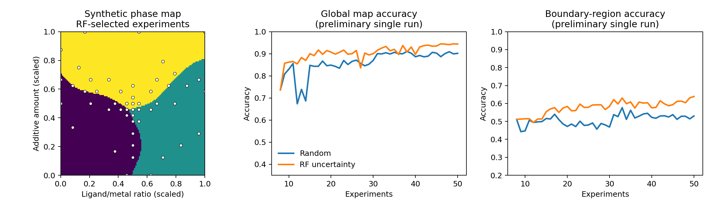

# PXRD Active Learning

Sequential experimental design for PXRD-guided phase mapping and phase
purification.

This repository develops and benchmarks methods that suggest which synthesis
condition should be tested next. It is intended for later integration with
experimental observations derived from powder X-ray diffraction (PXRD).

> **Current status:** no experimental dataset is included. Synthetic phase
> maps are used to develop, test, and compare sequential-design strategies
> before experimental integration.

## Scientific workflow

Each future experiment will connect synthesis conditions to an assigned phase
and PXRD-derived quality metrics. The model will operate in two modes:

- **Mapping mode:** improve the condition-phase map near boundaries and poorly
  sampled regions.
- **Purification mode:** refine conditions around a promising pattern to
  enhance the target phase and suppress competing phases.

The current prototype implements:

- a reproducible two-dimensional synthetic phase-map generator;
- configurable observation noise near phase boundaries;
- random sequential sampling as a baseline;
- random-forest uncertainty sampling with spatial diversity for mapping;
- global and boundary-region map-accuracy metrics;
- a reproducible demonstration figure and unit tests.



## Quick start

```bash
python -m pip install -e .
python examples/run_mapping_demo.py
python -m unittest discover -s tests -v
```

The example writes `docs/mapping_demo.png` and prints the final mapping
accuracy for both strategies.

## Roadmap

- [x] Synthetic phase-map environment
- [x] Random-sampling baseline
- [x] Random-forest uncertainty sampling
- [ ] Gaussian-process classification for mapping
- [ ] Boundary-aware acquisition functions
- [ ] Bayesian optimization for purification mode
- [ ] Robustness benchmarks against observation noise
- [ ] Interface for PXRD-derived experimental records

## Repository layout

```text
src/pxrd_active/       Core simulation and sequential-design code
examples/              Reproducible demonstrations
tests/                 Unit tests
docs/                  Generated figures and method notes
```

## Scope

This is a methodological research prototype. Synthetic results demonstrate
software behavior and do not represent experimental discovery or phase
identification.

## License

MIT
