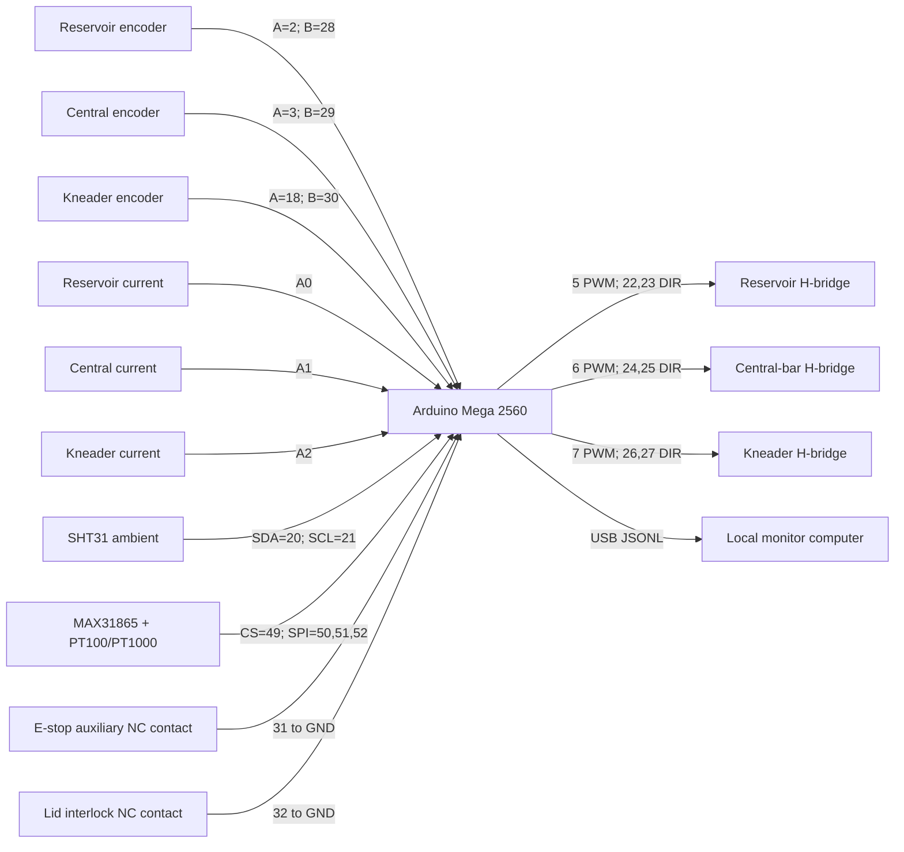
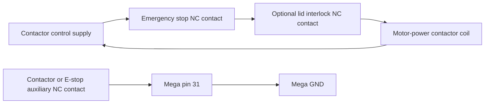

# Arduino Mega wiring

This wiring plan is the recommended prototype allocation for an Arduino Mega
2560. It assumes three brushed-DC motors, three external H-bridge channels,
one current sensor per motor, one encoder per motor, an SHT31-class ambient
sensor, and a PT100/PT1000 interface for the reactor.

The exact driver, current-sensor range, fuse values, wire gauge, and power
supply cannot be finalized until motor voltage and stall current are known.

## Pin allocation

| Arduino Mega pin | Signal | Connection |
|---|---|---|
| `5` PWM | Reservoir speed command | Reservoir driver `PWM/EN` |
| `22`, `23` | Reservoir direction | Reservoir driver `IN1`, `IN2` |
| `6` PWM | Central-bar speed command | Central-bar driver `PWM/EN` |
| `24`, `25` | Central-bar direction | Central-bar driver `IN1`, `IN2` |
| `7` PWM | Kneader speed command | Kneader driver `PWM/EN` |
| `26`, `27` | Kneader direction | Kneader driver `IN1`, `IN2` |
| `2`, `28` | Reservoir encoder A, B | Encoder outputs |
| `3`, `29` | Central-bar encoder A, B | Encoder outputs |
| `18`, `30` | Kneader encoder A, B | Encoder outputs |
| `A0` | Reservoir current | Current-sensor analog output |
| `A1` | Central-bar current | Current-sensor analog output |
| `A2` | Kneader current | Current-sensor analog output |
| `20` SDA | Ambient sensor data | SHT31 SDA |
| `21` SCL | Ambient sensor clock | SHT31 SCL |
| `49` | Reactor RTD chip select | MAX31865 CS |
| `50` MISO | Reactor RTD SPI | MAX31865 SDO |
| `51` MOSI | Reactor RTD SPI | MAX31865 SDI |
| `52` SCK | Reactor RTD SPI | MAX31865 CLK |
| `31` | Emergency-stop status | Normally closed auxiliary contact to GND |
| `32` | Lid/interlock status | Normally closed interlock contact to GND |
| `5V`, `GND` | Sensor logic power | Only for modules compatible with 5 V |
| USB | Serial telemetry | Local PC or Raspberry Pi |

Encoder A channels use interrupt-capable pins. Encoder B channels are read to
determine direction. Pins `20` and `21` remain reserved for I2C.

## Logic wiring



## Motor power wiring

Use a separate protected branch for each motor:

```text
motor PSU positive
  -> main fuse
  -> contactor main contact
  -> branch fuse
  -> current sensor IP+
  -> current sensor IP-
  -> H-bridge motor supply
  -> motor outputs
  -> motor

motor PSU negative
  -> H-bridge power ground
  -> current-sensor reference as required
```

Connect Arduino ground to each driver **logic ground**. Follow the driver and
current-sensor documentation when isolation is provided. Do not send motor
current through Arduino ground traces.

Each driver must have local bulk and ceramic decoupling close to its motor
supply pins. Twist motor leads, keep them away from temperature/encoder wiring,
and connect cable shields at the chosen enclosure grounding point rather than
creating uncontrolled ground loops.

## Emergency stop and interlock

The emergency stop must not depend on Arduino:



Use a rated contactor or safety relay to remove power from all motor drivers.
A second auxiliary contact reports the state to pin `31`. Configure the input
as `INPUT_PULLUP`: `LOW` means the closed circuit is healthy; `HIGH` means stop
pressed, cable broken, or connector removed.

The same fail-safe convention is used for the lid input on pin `32`.

## Temperature sensors

### Ambient

Connect the SHT31 module to `5V` or `3.3V` according to the specific breakout,
`GND`, `SDA=20`, and `SCL=21`. Place it in free air away from the motor drivers,
power supply, and direct reactor radiation.

### Reactor

Connect the PT100/PT1000 to the MAX31865 using the module configuration for its
actual 2-, 3-, or 4-wire probe. Prefer a 3- or 4-wire Class A probe. Electrically
isolate the probe from conductive reactor parts when required and secure it
with repeatable contact pressure and thermal interface material.

## Current sensors and torque estimation

Connect each current-sensor output to `A0`, `A1`, or `A2` only after confirming
that its maximum output cannot exceed the Mega analog-input range. Add the
filtering recommended by the sensor manufacturer.

Measuring current at the H-bridge supply is convenient but PWM recirculation
means it is not always identical to instantaneous winding current. Use averaged
current consistently and calibrate under the same PWM mode. Drivers with a
dedicated current-sense output can provide a cleaner signal.

## Before connecting motors

1. Verify logic with motors disconnected.
2. Confirm every driver input and output with a multimeter.
3. Test emergency stop and lid interlock using a lamp or low-power dummy load.
4. Apply a current-limited motor supply.
5. Test one motor at low PWM.
6. Confirm encoder direction and current polarity.
7. Repeat for the other motors.
8. Set software warnings only after hardware current protection is working.
