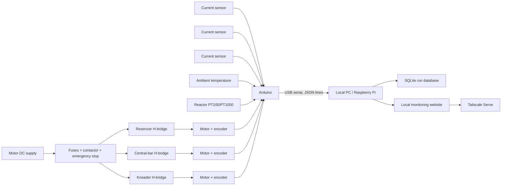

# Basic hardware architecture

This document describes a practical first prototype. Final motor drivers,
power supplies, fuses, and current sensors must be selected after measuring
the rated voltage, rated current, and stall current of each motor.

The detailed Arduino Mega pin allocation and power/signal wiring are in
[`arduino_wiring.md`](arduino_wiring.md).

## Recommended minimum

| Function | Basic hardware | Notes |
|---|---|---|
| Real-time controller | Arduino Mega 2560 | An Uno is sufficient for the current open-loop demo, but a Mega provides more pins and interrupt inputs for three encoders. |
| Local computer | Existing PC, mini PC, or Raspberry Pi | Stores the SQLite database and runs the monitoring website. |
| Motion | Three geared brushed-DC motors | Prefer motors with quadrature encoders. One motor each for the reservoir, central bar, and kneader. |
| Motor drive | Three H-bridge channels | Each channel must tolerate the motor supply voltage and at least the measured stall-current transient. |
| Motor power | Regulated DC supply | Size from simultaneous load and startup current. Keep motor power separate from Arduino logic power. |
| Current measurement | One bidirectional current sensor per motor | Select the current range from measured stall current. Use isolated Hall sensors for larger/noisier motors or a shunt monitor for lower currents. |
| Ambient temperature | SHT31/SHT35-class digital sensor | Keep it away from motor-driver heat and direct reactor contact. |
| Reactor temperature | Class A PT100 or PT1000 plus RTD interface | Attach mechanically to the reactor wall with appropriate thermal contact and electrical isolation. |
| Speed feedback | Encoder on each motor/output shaft | Required for actual RPM and useful torque estimation. |
| Safety | Normally closed emergency stop, contactor or safety relay, main switch, and branch fuses | The emergency stop must remove motor power in hardware. Software stop is secondary. |
| Electrical protection | Enclosure, terminals, strain relief, grounding, shielding, and flyback-capable drivers | Keep sensor wiring separated from PWM motor wiring. |

Useful optional items include driver/motor temperature sensors, a lid
interlock, an overcurrent relay, a small UPS for the local computer, and an
isolated USB connection when motor noise causes communication problems.

## Connection concept



The diagram omits detailed power wiring. Current sensors must be placed in the
motor/driver paths according to their manufacturer instructions.

## Can motor current measure torque?

For a brushed DC motor, electromagnetic motor torque is approximately
proportional to armature current:

```text
motor torque ~= torque constant * (motor current - no-load current)
output torque ~= motor torque * gear ratio * drivetrain efficiency
```

This is an **estimate**, not a direct torque measurement. It is affected by:

- startup and reversal current spikes;
- PWM ripple and current-sensor bandwidth;
- motor heating, brush friction, and bearing friction;
- gearbox losses and changing efficiency;
- speed and acceleration;
- scraper contact and mechanical misalignment.

A useful estimate therefore needs a current sensor for each motor, measured
RPM, the motor torque constant, gear ratio, and calibration against known
loads. For publishable absolute torque, add an inline rotary torque transducer
or a reaction torque/load-cell arrangement. Current alone is still valuable
for relative load, jam detection, endpoint detection, and reproducibility.

## First calibration sequence

1. Record zero-current offsets with motor power off.
2. Record no-load current versus PWM and RPM.
3. Apply several known loads and record current, RPM, and temperature.
4. Fit a calibration for each motor and direction.
5. Validate on loads not used in the fit.
6. Define warning and hard-stop thresholds below the driver and motor limits.

Do not infer safe current limits from software data alone. Use motor and driver
ratings, measured stall behavior, fuses, and hardware current protection.
